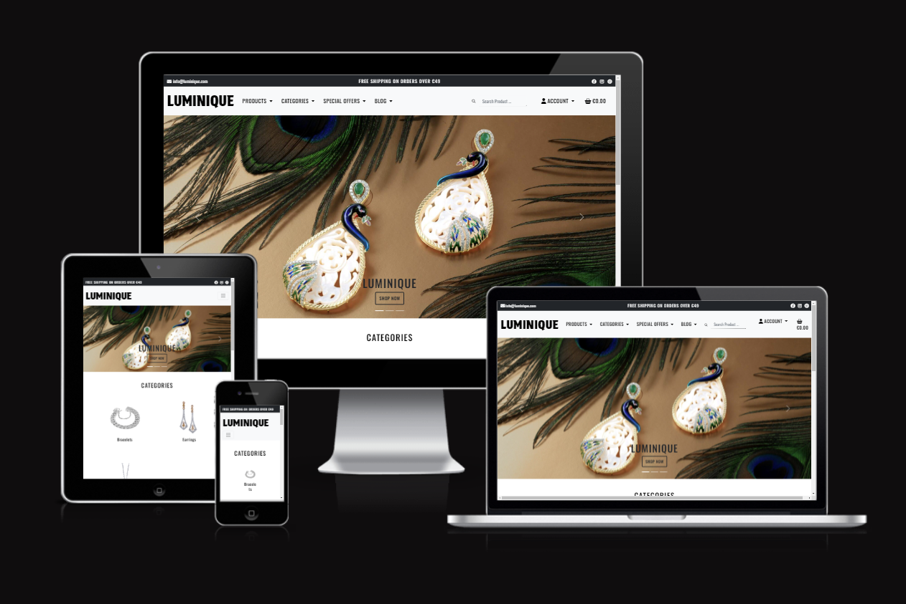
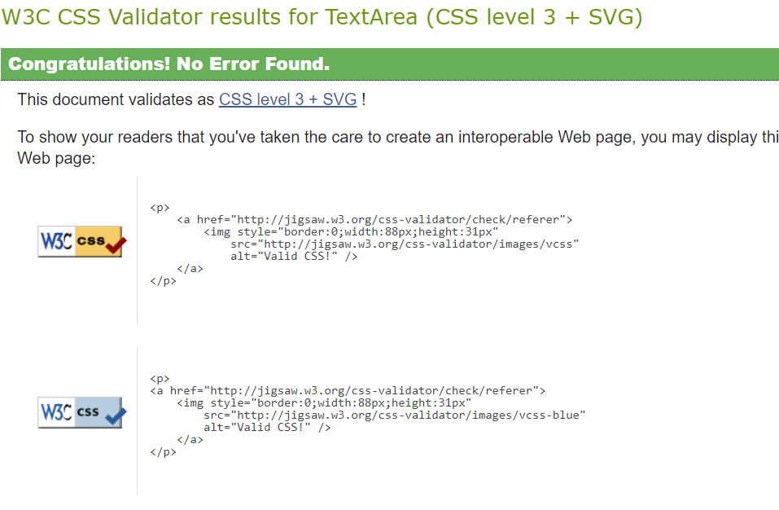
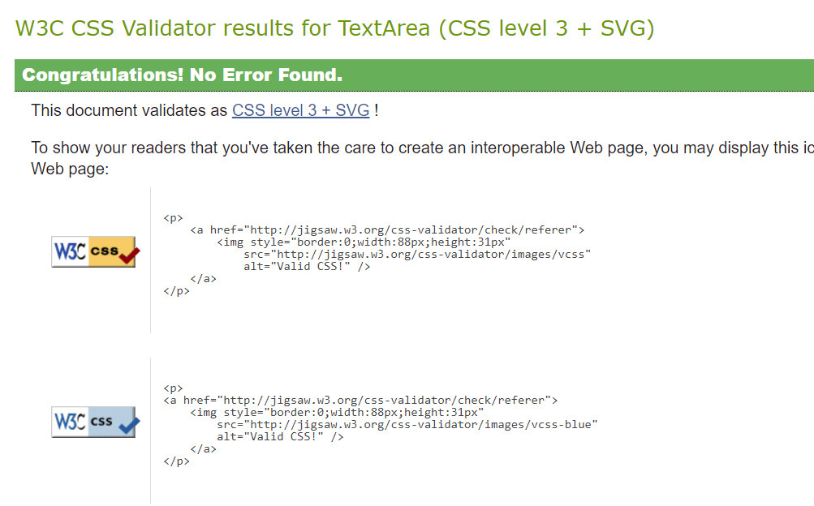
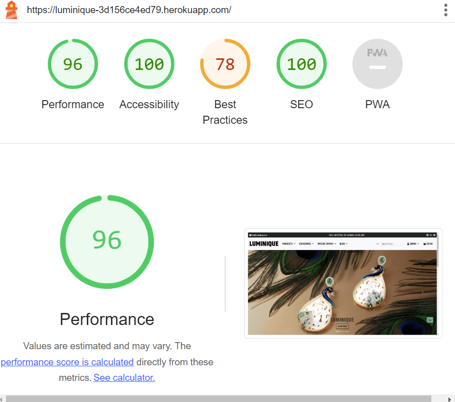
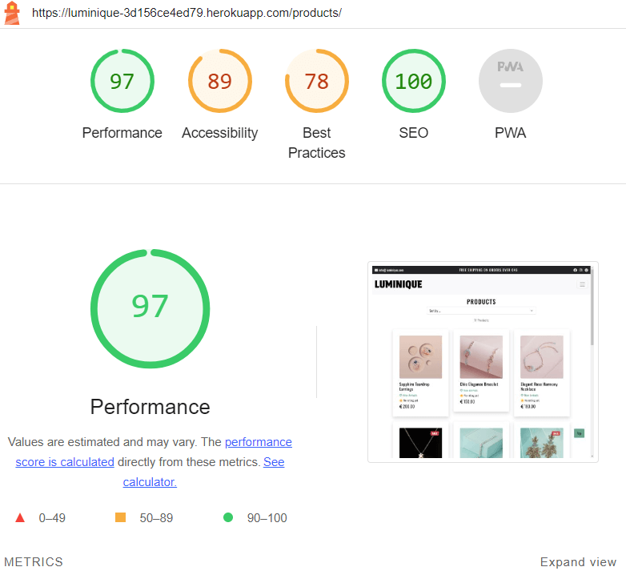
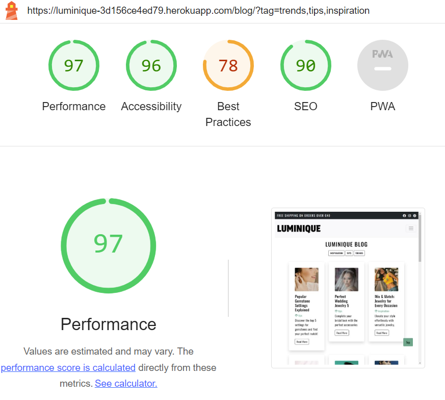
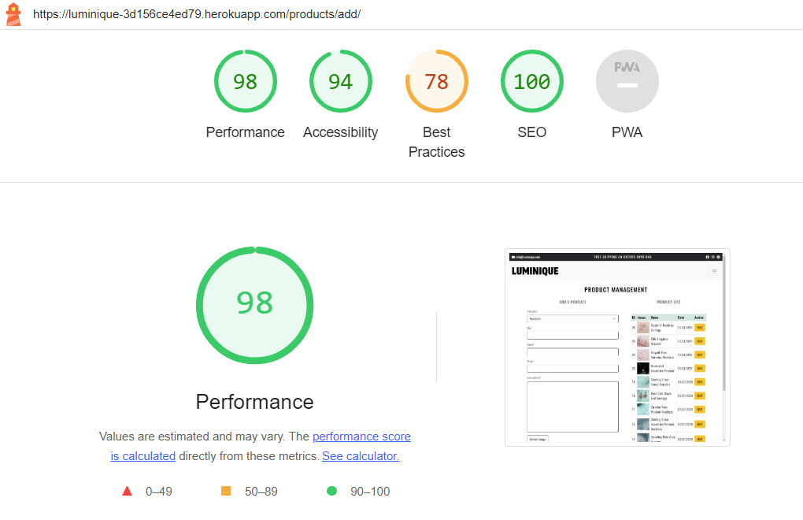
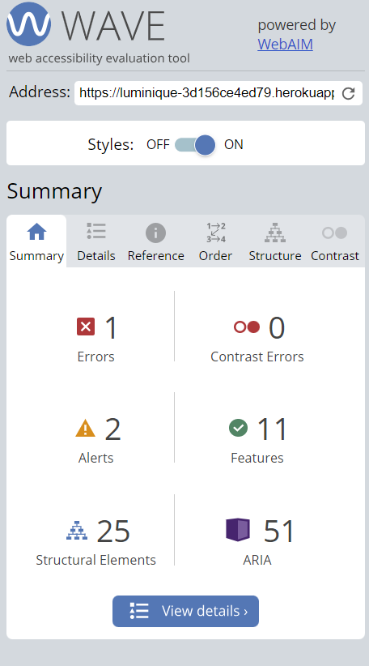
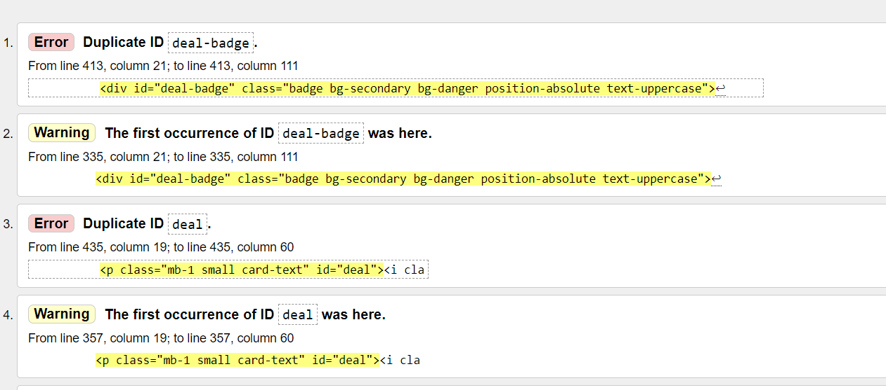
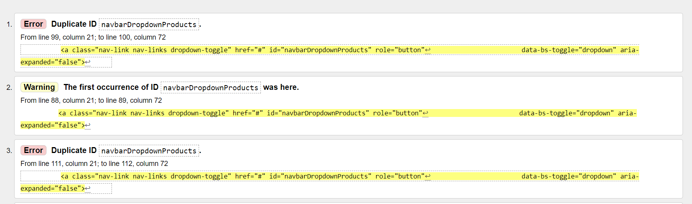

# **Luminique**

**Developer: Ksenia Sossin**
* [View Sweet Code Blog Repository](https://github.com/KseniaSOS/luminique_store)
* [View live website](https://luminique-3d156ce4ed79.herokuapp.com/)

Project was created for Portfolio Project #5 (E-Commerce Applications Portfolio Project) - Diploma in Full Stack Software Development Diploma at the [Code Institute](https://www.codeinstitute.net).

[View live website here]()

# Table of Content

* [**Project**](<#project>)
    * [Introduction](<#introduction>)
    * [Site Users Goal](<#site-users-goal>)
    * [Business Goal](<#business-goal>)    
    * [Marketing](<#marketing>)
      * [Business Model](<#business-model>)
      * [Marketing Strategy](<#marketing-strategy>)        
    * [Project Management](<#project-management>)

* [**User Experience (UX)**](<#user-experience-ux>)
    * [Wireframes](<#wireframes>)
    * [User Stories](<#user-stories>)
    * [Site Structure](<#site-structure>)
    * [Design Choices](<#design-choices>)

* [**Existing Features**](<#existing-features>)
    * [Top Bar](<#top-bar>)
    * [Navigation](<#navigation>)
    * [Home](<#home>)
    * [Products](<#hero-image>)
    * [Product Detail View](<#product-detail-view>)
    * [Review](<#review>)
    * [Blog](<#blog>)
    * [Admin Area](<#admin-area>) 
    * [Product Menagemant](<#product-menagement>)        
    * [Blog Menagement](<#blog-menagement>)    
    * [Shopping Bag](<#shopping-bag>)
    * [Secure Checkout](<#secure-checkout>)
    * [Order Confirmation](<#order-confirmation>)
    * [Confirmation Emails](<#confirmation-emails>)    
    * [Sign Up](<#sign-up>)
    * [Sign In](<#sign-in>)
    * [Sign Out](<#sign-out>)
    * [Footer](<#footer>)
    * [Flash Messages](<#flash-messages-and-confirmation-pages-to-the-user>)

* [**Features Left To Implement**](<#features-left-to-implement>)

* [**Testing**](<#testing>)
    * [Manual Testing](<#manual-testing>)
    * [Code Validation](<#code-validation>)
    * [Additional Testing](<#additional-testing>)
    * [Known Bugs](<#known-bugs>)

* [**Technologies Used**](<#technologies-used>)
    * [Languages](<#languages>)
    * [Frameworks & Software](<#frameworks--software>)
    * [Libraries](<#libraries>)

* [**Deployment**](<#deployment>)
* [**Credits**](<#credits>)
* [Acknowledgements](<#acknowledgements>)

# Technologies Used
## Languages

* [Python](https://en.wikipedia.org/wiki/Python_(programming_language)) - Provides the functionality for the site.
* [HTML5](https://en.wikipedia.org/wiki/HTML) - Provides the content and structure for the website.
* [CSS](https://en.wikipedia.org/wiki/CSS) - Provides the styling for the website.
* [JavaScript](https://en.wikipedia.org/wiki/JavaScript) - Provides interactive elements of the website.

## Frameworks & Software

* [Bootstrap](https://getbootstrap.com/) - A CSS framework that helps building solid, responsive, mobile-first sites
* [Django](https://www.djangoproject.com/) - A model-view-template framework used to create the site
* [Balsamiq](https://balsamiq.com/) - Used to create the wireframe
* [Github](https://github.com/) - Used to host and edit the website
* [GitBash](https://en.wikipedia.org/wiki/Bash_(Unix_shell)) - Terminal in [Gitpod](https://www.gitpod.io) used to push changes to the GitHub repository
* [Heroku](https://en.wikipedia.org/wiki/Heroku) - A cloud platform that the application is deployed to
* [ElephantSQL](https://www.elephantsql.com/) - Provides a browser tool for SQL queries
* [Lighthouse](https://developer.chrome.com/docs/lighthouse/overview/) - Used to test performance of site
* [Google Chrome DevTools](https://developer.chrome.com/docs/devtools/) - Used to debug and test responsiveness
* [HTML Validation](https://validator.w3.org/) - Used to validate HTML code
* [CSS Validation](https://jigsaw.w3.org/css-validator/) - Used to validate CSS code
* [JSHint Validation](https://jshint.com/) - Used to validate JavaScript code
* [PEP8 Validation](https://pep8ci.herokuapp.com/) - Used to validate Python code
* [SmartDraw](https://app.smartdraw.com/) - Used for creating the Model Schema
* [Font Awesome](https://fontawesome.com/) - Used for icon features on the site
* [Google Fonts](https://fonts.google.com/) - used to import fonts for the website
* [Tynypng](https://tinypng.com/) - Used for compressing all images
* [Am I Responsive?](https://ui.dev/amiresponsive) - Used for createing responsive deisign image
* [Favicon](https://favicon.io/) - Used to create the favicon
* [Mailchimp](https://mailchimp.com/) - Used for the newsletter functionality on the site
* [Amazon Web Services](https://aws.amazon.com/) - A service that hosts all static files and images in the project

## Libraries

* [asgiref](https://pypi.org/project/asgiref/) - ASGI is a standard for Python asynchronous web apps and servers to communicate with each other, and positioned as an asynchronous successor to WSGI.
* [cryptography-3.4.8](https://pypi.org/project/cryptography/3.4/) - Cryptography is a package which provides cryptographic recipes and primitives to Python developers.
* [Django](https://pypi.org/project/Django/) - Django is a high-level Python web framework that encourages rapid development and clean, pragmatic design.
* [django-allauth](https://pypi.org/project/django-allauth/) - Integrated set of Django applications addressing authentication, registration, account management as well as 3rd party (social) account authentication.
* [django-crispy-forms](https://pypi.org/project/django-crispy-forms/) - Used to integrate Django DRY forms in the project.
* [gunicorn](https://pypi.org/project/gunicorn/) - Gunicorn ‘Green Unicorn’ is a Python WSGI HTTP Server for UNIX. It’s a pre-fork worker model ported from Ruby’s Unicorn project. The Gunicorn server is broadly compatible with various web frameworks, simply implemented, light on server resource usage, and fairly speedy.
* [oauthlib](https://pypi.org/project/oauthlib/) - OAuthLib is a framework which implements the logic of OAuth1 or OAuth2 without assuming a specific HTTP request object or web framework.
* [Pillow](https://pypi.org/project/Pillow/) - The Python Imaging Library adds image processing capabilities to your Python interpreter.
* [psycopg2](https://pypi.org/project/psycopg2/) - Psycopg is the most popular PostgreSQL database adapter for the Python programming language.
* [PyJWT](https://pypi.org/project/PyJWT/) - A Python implementation of RFC 7519.
* [python3-openid](https://pypi.org/project/python3-openid/) - OpenID support for modern servers and consumers.
* [pytz](https://pypi.org/project/pytz/) - This is a set of Python packages to support use of the OpenID decentralized identity system in your application, update to Python 3
* [requests-oauhlib](https://pypi.org/project/requests-oauthlib/) - P    rovides first-class OAuth library support for Requests.
* [sqlparse](https://pypi.org/project/sqlparse/) - sqlparse is a non-validating SQL parser for Python. It provides support for parsing, splitting and formatting SQL statements.
* [stripe](https://pypi.org/project/stripe/) - A Python library for Stripe’s API.

[Back to top](<#table-of-content>)

# Testing
## Manual Testing
BDD, or Behaviour Driven Development, is the process used to test user stories in a non-technical way, allowing anyone to test the features of an app.

[Back to top](<#table-of-content>)

## Code Validation
### Markup Validation

The website Luminique was validated by [W3C html Validator](https://validator.w3.org/). There were some errors, which i described in bud section. But in general all pages were without errors, just with warnings about js.

<b>HTML Validation Result</b>

 

### CSS Validaton

The CSS have been run through the [W3C CSS Validator](https://jigsaw.w3.org/css-validator/), which reports no errors.

<b>CSS Validation Result</b>

 

### JavaScript Validation

[JSHint](https://jshint.com/) was used to validate the JavaScript of the website, which reports no errors.
 
* stripe_elements.js in checkout app - No errors reported
* inline jscript in bag.html in bag app - No errors reported
* inline jscript in products.html in products app - No errors reported
* inline jscript in base.html in root templates - No errors reported
* inline jscript in footer.html in root templates - No errors reported
* inline jscript in all_posts.html in blog app - No errors reported
* inline jscript in policy_privacy.html in home app - No errors reported

### PEP Validation
CI Python Linter [Code Institute Linter](https://pep8ci.herokuapp.com/) was used to validate the Python code in the project. Following files have been validated:

**App Bag**
* admin.py -  No errors reported
* apps.py -  No errors or warnings reported
* contexts.py -  No errors or warnings reported
* urls.py -  No errors or warnings reported
* views.py -  No errors or warnings reported
* bag_tools.py - No errors or warnings reported

**App Blog**
* admin.py - No errors reported
* apps.py - No errors reported
* forms.py - No errors reported
* models.py - No errors reported
* urls.py - No errors reported
* views.py - No errors reported

**App Checkout**
* __init__.py - No errors reported
* admin.py - No errors reported
* apps.py - No errors reported
* forms.py - No errors reported
* models.py - No errors reported
* signals.py - No errors reported
* urls.py - No errors reported
* views.py - No errors reported
* webhook_handler.py - 2 line-too-long errors reported

**App Home**
* apps.py - No errors reported
* urls.py - No errors reported
* views.py - No errors reported

**App Products**
* admin.py - No errors reported
* apps.py - No errors reported
* forms.py - No errors reported
* models.py - No errors reported
* urls.py - No errors reported
* views.py - No errors reported
* widgets.py - No errors reported

**App Profiles**
* apps.py - No errors reported
* forms.py - No errors reported
* models.py - No errors reported
* urls.py - No errors reported
* views.py - No errors reported

**luminque**
* urls.py - No errors reported
* views.py - No errors reported

**other**
* custom_storages.py - No errors reported

[Back to top](<#table-of-content>)

## Additional Testing

### Responsiveness Test

* The responsive design tests were carried out manually with [Google Chrome DevTools](https://developer.chrome.com/docs/devtools/) and [Responsive Design Checker](https://www.responsivedesignchecker.com/).

|        | Nexus 4 | Galaxy S5 | iPhone 3/4 | iPad Mini | iPad Pro | Display <1600px | Display >1600px |
|--------|---------|-----------|------------|-----------|----------|-----------------|-----------------|
| Render | pass    | pass      | pass       | pass      | pass     | pass            | pass            |
| Images | pass    | pass      | pass       | pass      | pass     | pass            | pass            |
| Links  | pass    | pass      | pass       | pass      | pass     | pass            | pass            |

Hover effect on blog categories is bigger than images. This can be seen just on big screens more then 1600x900.

<b>Responsive Design Checker</b>

 

### Browser Compatibility

* Google Chrome Version 
* Apple Safari 
* Microsoft Edge 

[Back to top](<#table-of-content>)

### Lighthouse

Google Lighthouse in Chrome Developer Tools was used to test the site within the areas of Performance, Accessibility, Best Practices and SEO. I tested the home page, view all blog posts page, view all products page, product management page and blog management page. 

<b>Lighthouse</b>

 

### WAVE

[WAVE](https://wave.webaim.org/) was used to check accessibility. There was an error in footer sections, which is described in bugs section.

<b>WAVE Result</b>

 

## Known bugs
### Fixed Bugs

* Dulicate ID on all_products page. 
  * Changed id to class and remaned.

    

<b>Html Validator</b>

    
    
    
 
  

### Unfixed Bugs

* Missing form label. 
  * This was a code from Mailchimp, so I didn't changed it to escape problems in the future.

    

<b>Wave Bug</b>

    
    
    
 
  