# **Luminique**

**Developer: Ksenia Sossin**
* [View Sweet Code Blog Repository](https://github.com/KseniaSOS/luminique_store)
* [View live website](https://luminique-3d156ce4ed79.herokuapp.com/)

# Table of Content

* [**Project**](<#project>)
    * [Introduction](<#introduction>)
    * [Site Users Goal](<#site-users-goal>)
    * [Business Goal](<#business-goal>)    
    * [Marketing](<#marketing>)
      * [Business Model](<#business-model>)
      * [Marketing Strategy](<#marketing-strategy>)        
    * [Project Management](<#project-management>)

* [**User Experience (UX)**](<#user-experience-ux>)
    * [Wireframes](<#wireframes>)
    * [User Stories](<#user-stories>)
    * [Site Structure](<#site-structure>)
    * [Design Choices](<#design-choices>)

* [**Existing Features**](<#existing-features>)    
    * [Navigation](<#navigation>)
    * [Home](<#home>)
    * [Products](<#hero-image>)
    * [Product Detail View](<#product-detail-view>)
    * [Review](<#review>)
    * [Blog](<#blog>)
    * [Post Detail View](<#post-detail-view>)
    * [Wishlist](<#Wishlist>)    
    * [Shopping Bag](<#shopping-bag>)
    * [Secure Checkout](<#secure-checkout>)
    * [Order Confirmation](<#order-confirmation>)
    * [Confirmation Emails](<#confirmation-emails>)
    * [Product Menagemant](<#product-menagement>)        
    * [Blog Menagement](<#blog-menagement>)
    * [Sign Up](<#sign-up>)
    * [Sign In](<#sign-in>)
    * [Sign Out](<#sign-out>)
    * [Footer](<#footer>)
    * [Flash Messages](<#flash-messages-and-confirmation-pages-to-the-user>)

* [**Features Left To Implement**](<#features-left-to-implement>)

* [**Testing**](<#testing>)
    * [Manual Testing](<#manual-testing>)
    * [Code Validation](<#code-validation>)
    * [Additional Testing](<#additional-testing>)
    * [Known Bugs](<#known-bugs>)

* [**Technologies Used**](<#technologies-used>)
    * [Languages](<#languages>)
    * [Frameworks & Software](<#frameworks--software>)
    * [Libraries](<#libraries>)

* [**Deployment**](<#deployment>)
* [**Credits**](<#credits>)
* [Acknowledgements](<#acknowledgements>)

# **Project**

## Introduction

Introducing Luminique, your ultimate online destination for exquisite and stylish jewelry that caters to the fashion-forward woman. Jewelry crafted from the finest materials, including gold, silver, and sparkling zirconium stones. Designed to appeal to a broad age range from 16 to 60 years, Luminique ensures that every piece resonates with the personal style  of  customers. All products have information and responsive customer support. The site also offers a blog that is handled by Luminique Team with information about their latest releases and other relevant content for the site visitor. Luminique is committed to providing a seamless and secure online shopping experience. 

Project was created for Portfolio Project #5 (E-Commerce Applications Portfolio Project) - Diploma in Full Stack Software Development Diploma at the [Code Institute](https://www.codeinstitute.net).

* [View live website here](https://luminique-3d156ce4ed79.herokuapp.com/)
 

## Site Users Goal

Buyers love modern and stylish jewelry that easily suits their tastes and fashion preferences. The goal is to ensure that the site is easy to use. A visually appealing website that will allow customers to browse, search and purchase jewelry easily. Buyers expect quality jewelry made from real gold, silver and semi-precious stones. They want to make sure they are getting good value for money. Therefore, detailed product descriptions are desired, including materials used, sizes, care instructions, and reviews to help customers make an informed purchasing decision. Customers expect responsive support to answer questions, resolve problems, and promptly help resolve any issues. The buyer is provided with secure online transactions and protection of confidential financial information of clients.

## Business Goal

The main business goal of online jewelry store is to increase sales of contemporary jewelry. The site owner can provide an intuitive and secure site, ensuring a smooth shopping experience and effective product presentation.
To increase new customers and retain existing customers, various marketing strategies are implemented to encourage repeat purchases and increase customer loyalty through loyalty programs.

To check whether these goals are being achieved, site owner can use various measurement and analysis tools, such as:
- Sales revenue and conversion rate
- Website traffic and user engagement analytics (Google Business, Google Ads, Google Analytics)
- Customer satisfaction surveys and feedback
- Monitoring product returns and customer complaints
- Regular technical testing of the site to eliminate potential problems
- Constant monitoring of SEO metrics

Regular review and analysis of these indicators will help evaluate the effectiveness of all strategies and make the necessary adjustments to achieve the goals of the business and customers of the online jewelry store.

[Back to top](<#table-of-content>)

## Marketing
### Business Model

The business model is focused on selling jewelry to individuals and involves a single payment, making our business model a B2C (Business to Consumer) model. This approach allows us to engage directly with our customers and provide them with a seamless shopping experience. The website is highly adjustable to adapt to customer needs, and effective marketing techniques are essential to reaching and engaging our audience.

### Marketing Strategy

#### Optimize For Mobile Devices.

In a mobile-centric world, our website is fully responsive to ensure an excellent user experience on both mobile and desktop devices. We prioritize mobile accessibility to reach a wider audience.

#### Website Layout.

Our website boasts an intuitive and easy-to-navigate design, making it effortless for customers to find relevant information and make purchases without any hassle. User experience is at the core of our design principles.

#### Marketing Techniques

When it comes to marketing jewelry business, it's essential to choose the right marketing types that align with our target market and goals.

There are 4 key marketing types that can benefit your jewelry business:
* Content Marketing
* Social Media Marketing
* SEO (Search Engine Optimization)
* Email Marketing

**Content Marketing**

Content marketing involves creating valuable and engaging content to attract and convert target customers, building trust and loyalty. It requires consistency and organization but can effectively demonstrate expertise and attract relevant clients. 
Luminique maintains a blog on the website, where there is  original, informative, and relevant content for customers. The aim is to make customers want to visit the web site because they genuinely find it valuable.

**Social Media Marketing** 

Luminique Shop maintains an active presence on social media platforms, including Facebook and Instagram. These platforms help us engage with both existing and potential customers. We use them to create engagement, interact broadly, and maintain brand recognition. Our social media channels also serve as a means to drive traffic to our website, especially when we publish new blogs or feature the product of the month. Currently, our focus is on organic growth, but we may explore paid ads targeting specific customer groups in the future.

- Instagram/Facebook: Using visually appealing images and videos (shorts/reels) to showcase their beauty and elegance. The visual nature of Instagram is perfect for showcasing jewelry. To increase visibility, it is also worth using hashtags.

- Pinterest is a popular platform for discovering new trends and products, making it an ideal platform for our target audience. We need to create boards that feature jewelry collections, styling tips, and fashion ideas.

- Influencer Partnerships: Collaboration with influencers or micro-influencers who resonate with our target audience. They can create authentic content featuring Luminique jewelry, reaching their followers and potentially driving traffic and sales to our online store.

**Email Marketing**

Email marketing is highlighted as beneficial for almost all e-commerce businesses, offering advantages such as scalability, permission-based contact lists. Luminique offers site users the option to sign up for our newsletter, powered by Mailchimp. This newsletter keeps customers informed about the latest developments at Luminique Online Shop, including new blog posts, the product of the month, events, collaborations, and discount codes.

**Search Engine Optimization (SEO)**

SEO is critical to improving search engine rankings and user experience. Luminique is focusing on leveraging semantic HTML elements, keywords, and metadata to improve visibility on search engines. Using Wordtracker, a search was made for keywords that match the users' search criteria. 

*Meta Description*: LUMINIQUE is an online jewelry shop. Modern Jewelry crafted from silver and gold, adorned with cubic zirconia. Enjoy the convenience of global delivery on our handcrafted silver and gold pieces.

*Meta Keywords*: luminique, jewelry, bracelets, earrings, necklaces, gold-plated, silver, cubic zirconia, gifts, e-shop, online-shop, jewelry store, jewelry blog, email-newsletter, global delivery.

The website incorporates essential components like a sitemap.xml and robots.txt to facilitate search engine indexing and crawling. These files ensure that search engines can easily locate and access the site's pages, enhancing its visibility and search engine optimization (SEO) performance.

<b>Facebook Page</b>

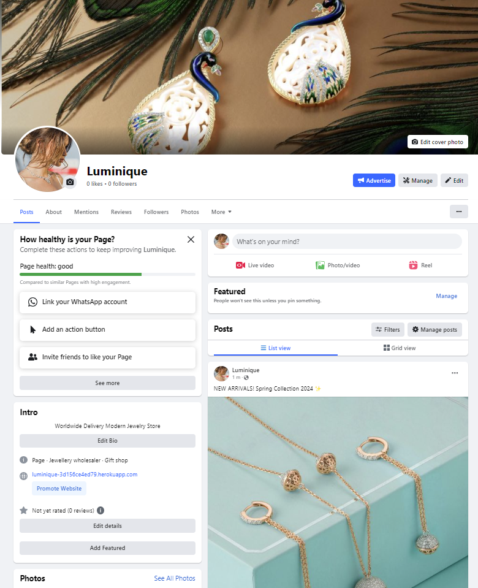

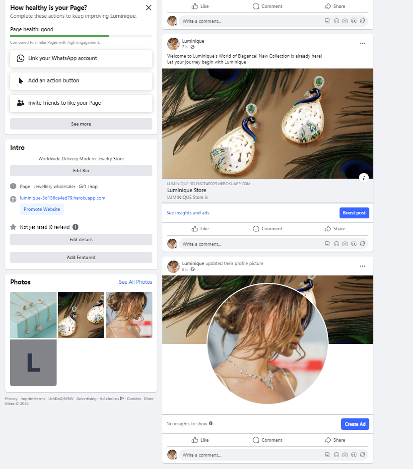

 

[Back to top](<#table-of-content>)

## Project Management
### Github Board

I've been using the [project board](https://github.com/users/KseniaSOS/projects/7/views/1) in GitHub to keep my project together. It has been working really well and has helped me structure up my work a lot. GitHub was used to plan and organize my hole project and user stories.

<b>Github Board</b>

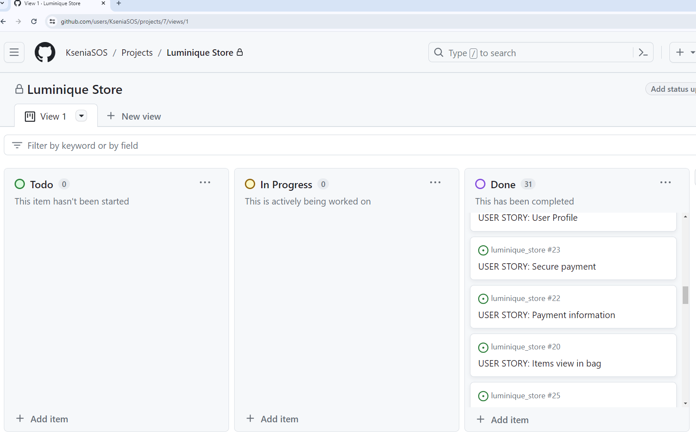

 

[Back to top](<#table-of-content>)

### Database Schema

I used the SmartDraw modelling tool to create the database schema. it shows the relationships between the different models in the database connected to the application.

Models used (besides standard user model) in this project are:

**App: Blog**
* **PostCategory** - Designed to manage blog categories.
* **Post** - Manages blog posts, linking them to their categories through a ForeignKey to the `PostCategory` model for proper categorization.

**App: Checkout**
* **Order** -  Responsible for managing customer orders, including storing delivery information, generating order numbers, and updating totals. It's linked to the user_profile model through a foreign key.
* **OrderLineItem** - Keeps track of each order item in each order the customer with ForeignKeys to the Order and Product model.

**App: Products**
* **Category** - Handles product categories.
* **Product** - This model is tasked with managing the details of products, such as price, name, and category. It includes a ManyToMany connection to the User model to facilitate tracking of products in users' wishlists.
* **Review** - This model manages product reviews, allowing users to leave feedback on products they have purchased or used.

**App: Profiles**
* **UserProfile** - This model maintains user-related information, including delivery details and order history. It features a method to either create a new user profile or update an existing one, ensuring that user information is current and accurate.

<b>Database Schema</b>

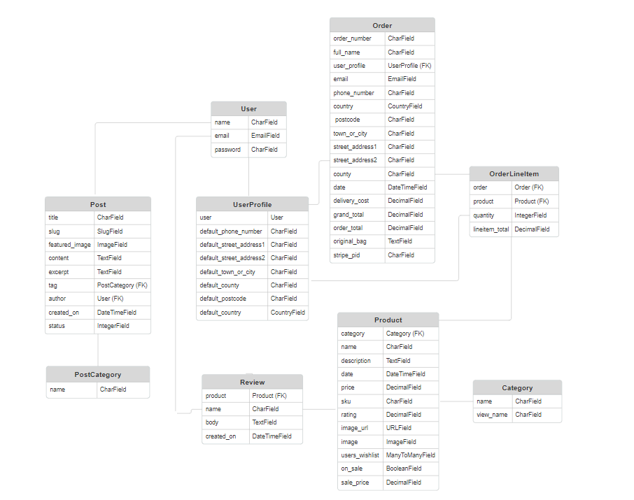

 

[Back to top](<#table-of-content>)

# **User Experience (UX)**
## Wireframes

The wireframes were produced in Balsamiq. There are frames for a full width display, tablets and a small mobile device.

<b>Wireframes</b>

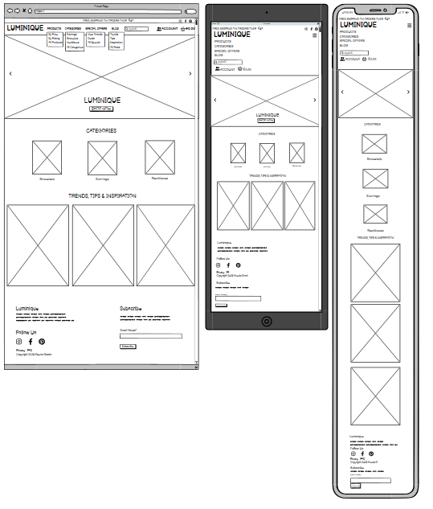

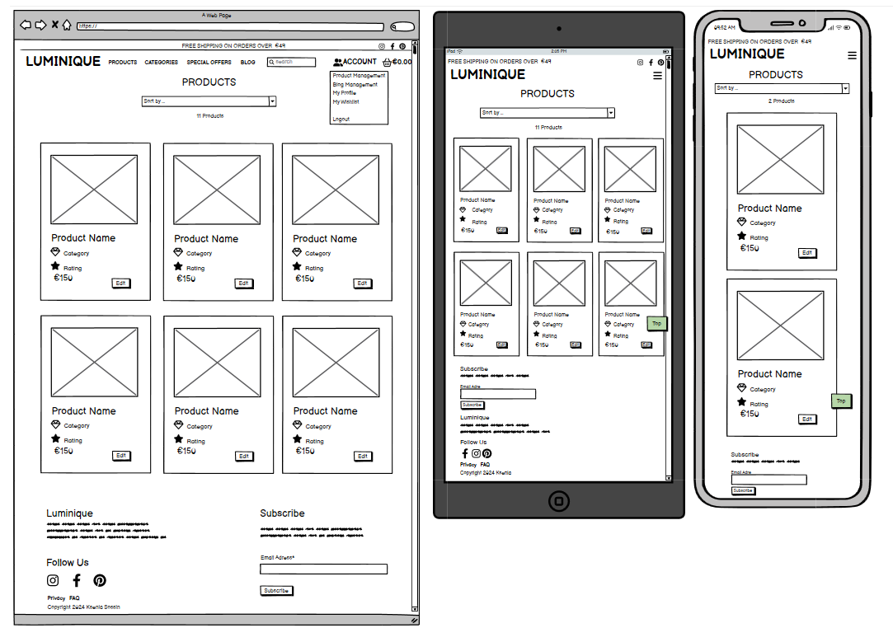

 

## User Stories
### Viewing And Navigation

| User Role | Action | Goal | Completed |
|-----------|--------|------|:---------:|
| Shopper | View a list of products | To select some to purchase | ☑ |
| Shopper | Click on a specific product | To view its details like price, description, product rating, and product image | ☑ |
| Shopper | read product reviews | to base my purchasing decisions on them | ☑ |
| Shopper | leave a review about a product | It can be seen by other site visitors as well as the owner of the online store. | ☑ |
| Shopper | View the total of my purchases at any time | To avoid spending too much | ☑ |
| Shopper | Contact Shop in an easy way | To interact with them if needed | ☑ |
| Shopper | View the site owner's blog post | To get the latest information about tips and trends | ☑ |

### Registration And User Accounts

| User Role | Action | Goal | Completed |
|-----------|--------|------|:---------:|
| Site User | Easily register for an account | To have a personal account | ☑ |
| Site User | Easily login or logout | To view my profile and access my personal account information | ☑ |
| Site User | Have my own user profile | To view my personal order history, update my contact or payment information | ☑ |
| Site User | Easily recover my password in case I forget it | To recover access to my account | ☑ |
| Site User | Receive an email confirmation after registering | To verify that my account registration was successful | ☑  |
| Site User | Create a wishlist | To come back later to purchase the products | ☑ |

### Sorting And Searching

| User Role | Action | Goal | Completed |
|-----------|--------|------|:---------:|
| Shopper | Sort through all the available products | To identify the best rated, best priced, and products based on category | ☑ |
| Shopper | Sort a specific category of product | To find the best rated or best priced in the specific category or sort the products in that category by name | ☑ |
| Shopper | Use a search input | To find a specific product | ☑ |
| Shopper | See the list of what I have searched for and the number of results | To quickly decide what is available and I want to purchase | ☑ |
| Shopper | View posts sorted by category  | To narrow my search and focus on a particular category of personal interest | ☑ |

### Purchasing And Checkout

| User Role | Action | Goal | Completed |
|-----------|--------|------|:---------:|
| Shopper | Easily select the quantity of a product when purchasing it | To ensure I get the correct product and quantity | ☑ |
| Shopper | Easily view items in my bag to be purchased | To see the total cost and all items I will get | ☑ |
| Shopper | Adjust the amount of products in my bag | To easily make changes to my purchase before checkout | ☑ |
| Shopper | Provide my payment information in a simple way | To make the checkout process quick and easy | ☑ |
| Shopper | Feel safe and secure while giving my personal and payment data | To confidently provide the needed information to make a purchase | ☑ |
| Shopper | View an order confirmation after checkout | To ensure that the order was placed correctly | ☑ |
| Shopper | Receive an email confirmation after completed checkout | To keep the confirmation for my records | ☑ |
| Shopper | Receive an email confirmation when my order changes | To get relevant information about my order | ☒ |

### Site Admin

| User Role | Action | Goal | Completed |
|-----------|--------|------|:---------:|
| Site Admin | Add, edit or delete products on my site | To manage my Store content | ☑ |
| Site Admin | Log out from the site | To feel safe that nobody can access the admin area | ☑ |
| Site Admin | Create blog posts drafts | To finish writing the content later | ☑ |
| Site Admin | Create, update and delete blog posts | To manage my blog content on my site | ☑ |

[Back to top](<#table-of-content>)

## Site Structure
The Luminique has an minimalistic, clean and intuitive design that makes the site easy to navigate for the user. The site is visible for two types of users: when **the user is logged out** and when **the user is logged in**.

Current pages:

  * Home 
  * Products/Product detail view
  * Blog/Post detail view  
  * My Profile *(just for authenticated user)*
  * My Bag *(just for authenticated user)*
  * Checkout *(just for authenticated user)*
  * My wishlist *(just for authenticated user)*
  * Product/Post Management *(just for admin)* 
  * SignUp/ LogIn / LogOut

Read more details about different pages in the [Features](<#features>) section.

[Back to top](<#table-of-content>)

## Design Choices
### Color Scheme

I opted for a light theme for the Bootstrap navigation menu, employing a primary color scheme that includes various shades of green set against a white backdrop. Additionally, I incorporated other colors such as yellow for the rating icons and the Bootstrap buttons designated for warnings and dangers.

<b>Color Palette</b>

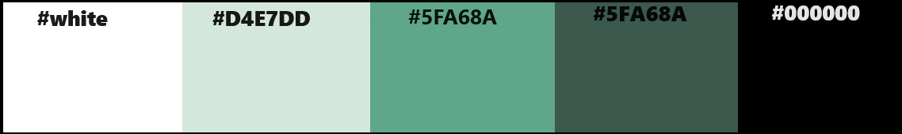

 

### Typography

**Protest Strike** - is an original solid but peaceful Sans Serif typeface for the logo of the site.

**Oswald** - used for all text on the site, including headings and links. It is a neutral font that is clearly visible and easy to read. It does not distract attention from the content.

<b>Google Font</b>

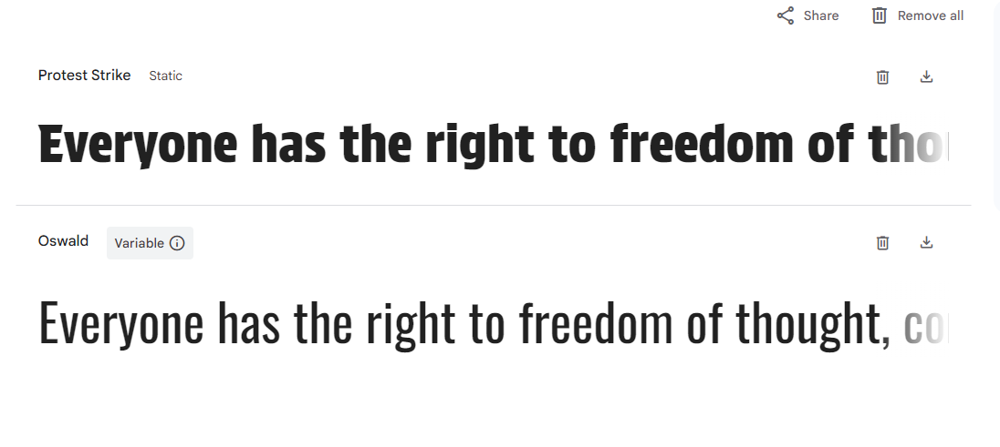

   

[Back to top](<#table-of-content>)

# **Features**
## **Existing Features**

### **Navigation**
The navigation bar is straightforward, featuring a logo and dropdown links to various pages. The visibility of certain menus changes based on the user's authentication status, with an additional menu item appearing for users logged in as administrators. Above the main navigation, a persistent top bar displays information about free shipping, the shop's email, and links to social media.

*Visible links to logged out users:*

* Logo - leads to the Home Page
* Products -  features a dropdown menu allowing sorting of products **by price**, **by rating** or displays **all products**
* Categories - offers a dropdown with options for product categories such as  **earrings**, **bracelets**, **Necklaces**, or a list of **all categories**
* SpecialOffers - presents a dropdown with options for **new arrivals**, **deals**, or a shows **all specials**
* Blog -  includes a dropdown menu categorizing posts into **trends**, **tips**, **inspiration** or displays **all posts**
* Search Box - enables users to find products throughout the site
* Account - provides access for users to sign in
* Bag - Shows the accumulated cost in the bag as items are added

<b>Navigation Large - User Not Logged In</b>

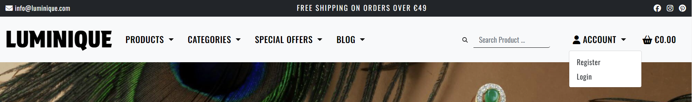

 

<b>Navigation Small - User Not Logged In</b>

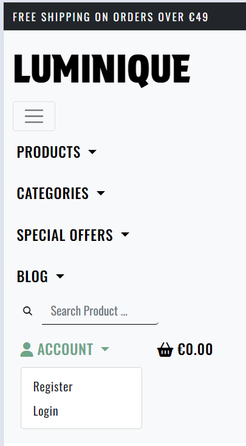

 

*Visible links to logged in users:*

All of the links that are visible to not authenticated users plus an extra dropdown menu with more links.

* My Profile - redirects to a page where users can modify their delivery details and view past orders (including confirmation receipts from previous purchases).
* My Wishlist - a personalized wishlist for users who are logged in.
* Log Out - signs the user out of their account.

<b>Navigation Large - User Logged In</b>

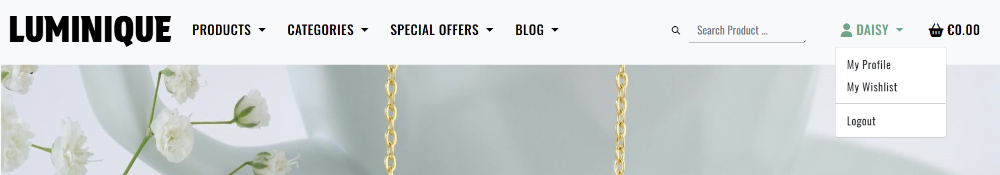

 

<b>Navigation Small - User Logged In</b>

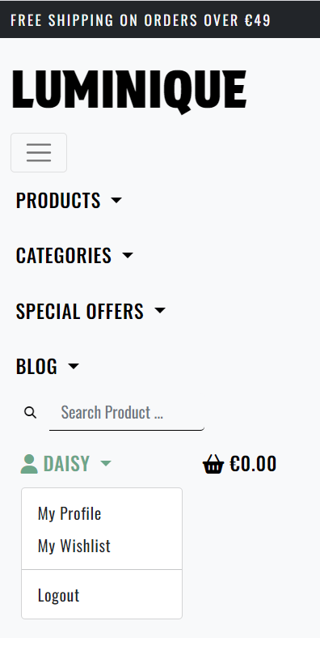

 

*Visible links if user is administrator:*

All of the links and two above.

* Product Management - redirects to a page where admin can manage products
* Blog Management - redirects to a page where admin can manage blog

<b>Navigation Large - Admin Logged In</b>

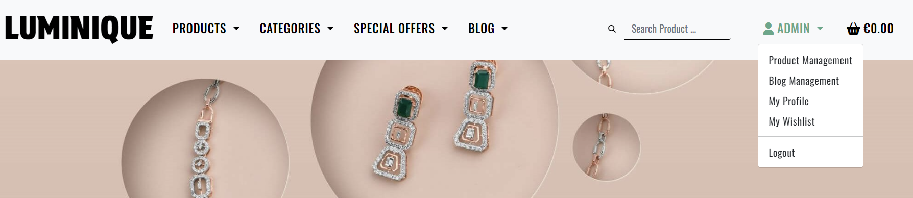

 

<b>Navigation Small - Admin Logged In</b>

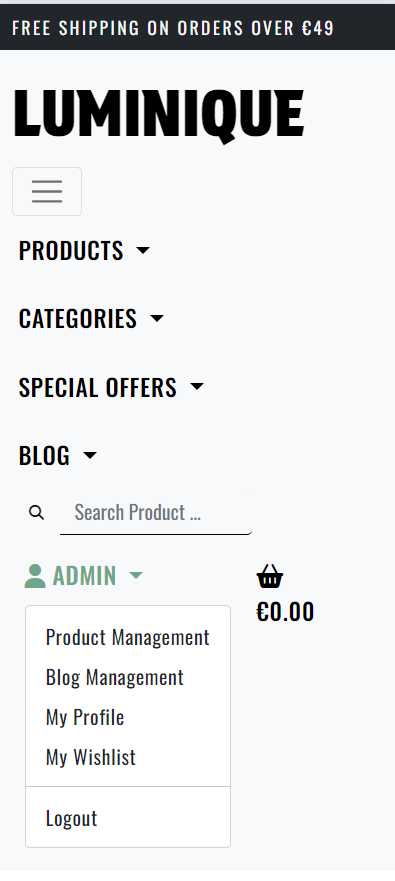

 

### **Home**

### **Products**
### **Product Detail View**

### **Review**
### **Blog** 
### **Post Detail View** 
### **Wishlist** 
### **Shopping Bag** 
### **Secure Checkout** 
### **Order Confirmation** 
### **Confirmation Emails**

Upon order confirmation, the user receives a confirmation email at their registered email address.

<b>Confirmation Email</b>

 

### **Product Menagemant**
### **Blog Menagement**
### **Sign Up**

If the site visitor has no registered user at Luminique Store, they have an opportunity to sign up. 

<b>Sign Up</b>

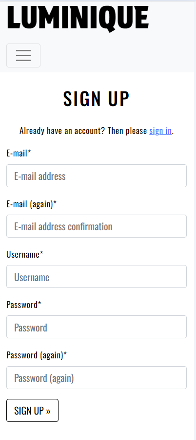

 

### **Sign In**

On this page all registered users can sign in or reset a passwrod if forgotten.

<b>Sign In</b>

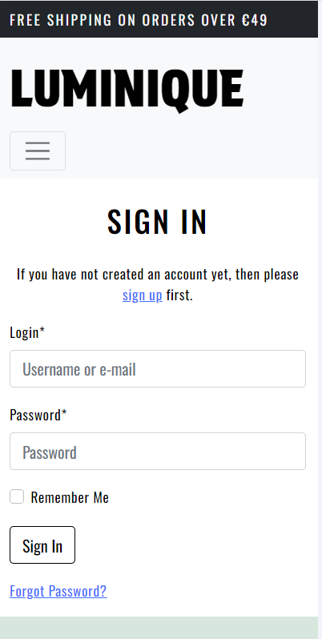

 

<b>Password Reset</b>

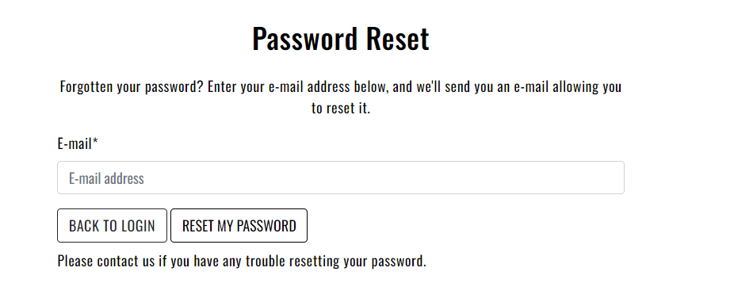
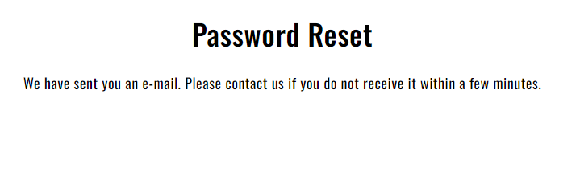

 

### **Sign Out**

Before sign out the site completely, users will be shown a page where they need to confirm their exit.

<b>Sign Out</b>

 

### **Footer**
The footer section features the Logo, connections to sicial media platforms, a subscription form for newsletters (via MailChimp), a direct link to Luminique's privacy policy, and a FAQ link that addresses frequently asked questions.

<b>Footer</b>

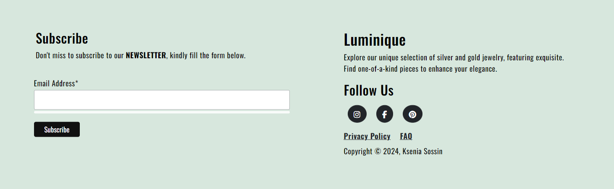

 

### **Flash Messages**
The sites incorporates flash messages and confirmation pages when an action has been performed (i.e. delete/update actions).

<b>Confirmation Messages</b>

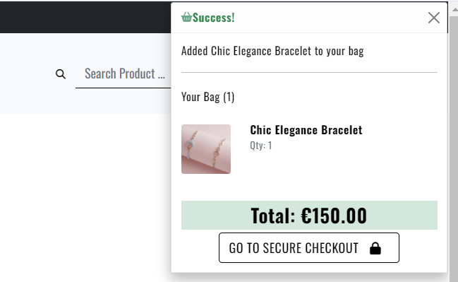

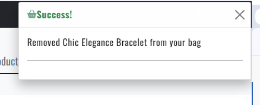

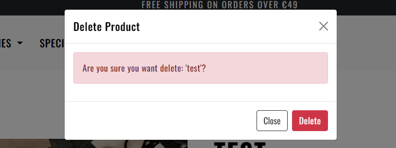

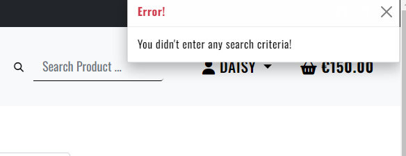

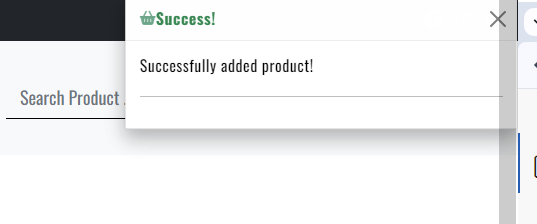

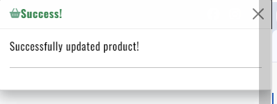

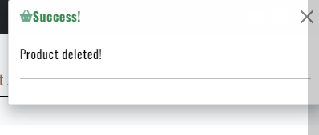

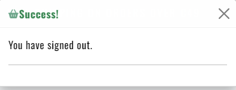

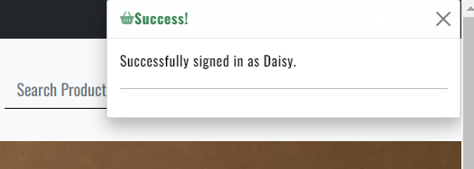

 

## **Features Left to Implement**

* Allow logged-in users to apply promotional codes
* Enable logged-in users to rate products, like posts
* Enhance email capabilities
* Incorporate a contact form
* Introduce subcategories like Collections (Spring, Winter, etc.), and a distinct Sale category

[Back to top](<#table-of-content>)

# Technologies Used
## Languages

* [Python](https://en.wikipedia.org/wiki/Python_(programming_language)) - Provides the functionality for the site.
* [HTML5](https://en.wikipedia.org/wiki/HTML) - Provides the content and structure for the website.
* [CSS](https://en.wikipedia.org/wiki/CSS) - Provides the styling for the website.
* [JavaScript](https://en.wikipedia.org/wiki/JavaScript) - Provides interactive elements of the website.

## Frameworks & Software

* [Bootstrap](https://getbootstrap.com/) - A CSS framework that helps building solid, responsive, mobile-first sites
* [Django](https://www.djangoproject.com/) - A model-view-template framework used to create the site
* [Balsamiq](https://balsamiq.com/) - Used to create the wireframe
* [Github](https://github.com/) - Used to host and edit the website
* [GitBash](https://en.wikipedia.org/wiki/Bash_(Unix_shell)) - Terminal in [Gitpod](https://www.gitpod.io) used to push changes to the GitHub repository
* [Heroku](https://en.wikipedia.org/wiki/Heroku) - A cloud platform that the application is deployed to
* [ElephantSQL](https://www.elephantsql.com/) - Provides a browser tool for SQL queries
* [Lighthouse](https://developer.chrome.com/docs/lighthouse/overview/) - Used to test performance of site
* [Google Chrome DevTools](https://developer.chrome.com/docs/devtools/) - Used to debug and test responsiveness
* [HTML Validation](https://validator.w3.org/) - Used to validate HTML code
* [CSS Validation](https://jigsaw.w3.org/css-validator/) - Used to validate CSS code
* [JSHint Validation](https://jshint.com/) - Used to validate JavaScript code
* [PEP8 Validation](https://pep8ci.herokuapp.com/) - Used to validate Python code
* [SmartDraw](https://app.smartdraw.com/) - Used for creating the Model Schema
* [Font Awesome](https://fontawesome.com/) - Used for icon features on the site
* [Google Fonts](https://fonts.google.com/) - used to import fonts for the website
* [Tynypng](https://tinypng.com/) - Used for compressing all images
* [Am I Responsive?](https://ui.dev/amiresponsive) - Used for createing responsive deisign image
* [Favicon](https://favicon.io/) - Used to create the favicon
* [Mailchimp](https://mailchimp.com/) - Used for the newsletter functionality on the site
* [Amazon Web Services](https://aws.amazon.com/) - A service that hosts all static files and images in the project

## Libraries

* [asgiref](https://pypi.org/project/asgiref/) - ASGI is a standard for Python asynchronous web apps and servers to communicate with each other, and positioned as an asynchronous successor to WSGI.
* [cryptography-3.4.8](https://pypi.org/project/cryptography/3.4/) - Cryptography is a package which provides cryptographic recipes and primitives to Python developers.
* [Django](https://pypi.org/project/Django/) - Django is a high-level Python web framework that encourages rapid development and clean, pragmatic design.
* [django-allauth](https://pypi.org/project/django-allauth/) - Integrated set of Django applications addressing authentication, registration, account management as well as 3rd party (social) account authentication.
* [django-crispy-forms](https://pypi.org/project/django-crispy-forms/) - Used to integrate Django DRY forms in the project.
* [gunicorn](https://pypi.org/project/gunicorn/) - Gunicorn ‘Green Unicorn’ is a Python WSGI HTTP Server for UNIX. It’s a pre-fork worker model ported from Ruby’s Unicorn project. The Gunicorn server is broadly compatible with various web frameworks, simply implemented, light on server resource usage, and fairly speedy.
* [oauthlib](https://pypi.org/project/oauthlib/) - OAuthLib is a framework which implements the logic of OAuth1 or OAuth2 without assuming a specific HTTP request object or web framework.
* [Pillow](https://pypi.org/project/Pillow/) - The Python Imaging Library adds image processing capabilities to your Python interpreter.
* [psycopg2](https://pypi.org/project/psycopg2/) - Psycopg is the most popular PostgreSQL database adapter for the Python programming language.
* [PyJWT](https://pypi.org/project/PyJWT/) - A Python implementation of RFC 7519.
* [python3-openid](https://pypi.org/project/python3-openid/) - OpenID support for modern servers and consumers.
* [pytz](https://pypi.org/project/pytz/) - This is a set of Python packages to support use of the OpenID decentralized identity system in your application, update to Python 3
* [requests-oauhlib](https://pypi.org/project/requests-oauthlib/) - P    rovides first-class OAuth library support for Requests.
* [sqlparse](https://pypi.org/project/sqlparse/) - sqlparse is a non-validating SQL parser for Python. It provides support for parsing, splitting and formatting SQL statements.
* [stripe](https://pypi.org/project/stripe/) - A Python library for Stripe’s API.

[Back to top](<#table-of-content>)

# Testing
## Manual Testing
BDD, or Behaviour Driven Development, is the process used to test user stories in a non-technical way, allowing anyone to test the features of an app.

### Viewing And Navigation

| User Story | Testing Results |
|------------|-----------------|
| As a Shopper I can view a list of products so that I can select some to purchase | Shoppers can browse through a list of products on the store's product page. |
| As a Shopper I can click on a specific product so that I can view its details like price, description, product rating, and product image | Each product card allows users to click through to a detailed product page that includes all specified details. |
| As a Shopper I want to read product reviews so that I can quickly base my purchasing decisions on them. | Every site visitor has the capability to read all reviews on the site. Each detailed product page offers this option  |
| As a Shopper I want to leave a review about a product so that it can be seen by other site visitors as well as the owner of the online store. | Every authenticated user is granted the ability to post a review on products. Each detailed product page offers this option |
| As a Shopper I can view the total of my purchases at any time so that I can avoid spending too much | The total cost of current purchases is displayed at the top of the screen next to the cart icon. This dynamic shopping cart icon, visible from any page, updates to show the total price of items in the cart. Clicking on the cart icon opens the shopping bag page, where the total purchase amounts are also visible.  |
| As a Site User I can contact the Shop in an easy way so that I can interact with them if I need to | An email address is displayed at the top of the website(on big screens) and is also available on the FAQ page, detailing how users can contact us. Social media links are showcased across the site, providing users with a direct pathway to connect with the shop owner.|
| As a Site User I can view the site owner's blog post so that I can get the latest information about tips and trends | A blog section is available in the navigation bar or on the home page with posts about tips, trends, and more. |

### Registration And User Accounts

| User Story | Testing Results |
|------------|-----------------|
| As a Site User I can easily register for an account so that I can have a personal account | The navigation menu offers a simple signup process that requires only minimal information from users.|
| As a Site User I can easily login or logout so that I can view my profile and access my personal account information | Login/logout functionality works smoothly, with a user-friendly interface. *My profile* page allows user to change their personal information |
| As a Site User I can have my own user profile so that I can view my personal order history, update my contact or payment information | Once a user has registered and logged in, selecting *My Profile* from the menu directs them to a profile page where they can view personal details and order history. |
| As a Site User I can easily recover my password in case I forget it so that I can recover access to my account | Password recovery process is in place, with users able to reset via email confirmation. |
| As a Site User I can receive an email confirmation after registering so that I can verify that my account registration was successful | Automatic email confirmation is sent upon successful registration. |

### Sorting And Searching

| User Story | Testing Results |
|------------|-----------------|
| As a Shopper I can sort through all the available products so that I can identify the best rated, best priced, and products based on category | Products can be sorted by various criteria directly from the navigation or from the sorting bar on the products page. |
| As a Shopper I can sort a specific category of product so that I can find the best rated or best priced in the specific category or sort the products in that category by name | Category-specific sorting is available, with options for rating, price, and alphabetical order. |
| As a Shopper I can use a search input so that I can find a specific product | A search bar is prominently placed in navigation menu and returns accurate results. |
| As a Shopper I can see the list of what I have searched for and the number of results so that I can quickly decide what is available and I want to purchase | The search results page clearly displays the number of results and the items found. |

### Purchasing And Checkout

| User Story | Testing Results |
|------------|-----------------|
| As a Shopper I can easily select the quantity of a product when purchasing it so that I can ensure I get the correct product and quantity | Product quantity selection is intuitive and accessible on the product detail page. |
| As a Shopper I can easily view items in my bag to be purchased so that I can see the total cost and all the items I will get | The shopping bag section offers a comprehensive overview of chosen items and their cumulative price, accessible at the top of the navigation menu. |
| As a Shopper I can adjust the amount of products in my bag so that I can easily make changes to my purchase before checkout | Users can modify product quantities or remove items from the bag on the shopping bag page |
| As a Shopper I can provide my payment information in a simple way so that I can make the checkout process quick and easy | The checkout process is streamlined, with clear fields for payment information. |
| As a Shopper I can feel myself safe and secure while giving my personal and payment data so that I can confidently provide the needed information to make a purchase | Payment process is secured with encryption, ensuring data safety. |
| As a Shopper I can view an order confirmation after checkout so that I ensure that the order was placed correctly and I have not made any mistakes | Order confirmation is displayed on-screen post-purchase and sent via email. |
| As a Shopper I can receive an email confirmation after completed checkout so that I can keep the confirmation for my records | An email summary of the purchase is automatically sent upon order completion. |
| As a Shopper I can receive an email confirmation when my order changes so that I get relevant information about my order | Currently, updates to orders are not automatically emailed to customers. This feature is pending. |
| As a Shopper I can create a wishlist so that I can come back later to purchase the products | Wishlist functionality allows users to save items for future consideration. |

### Site Admin

| User Story | Testing Results |
|------------|-----------------|
| As a Site Admin I can add, edit or delete products on my site so that I can manage my Store content | Full product management capabilities are available in the admin panel. |
| As a Site Admin I can log out from the site so that I can feel safe that nobody can access the admin area | Secure logout functionality ensures that admin sessions are properly closed. |
| As a Site Admin I can create blog posts drafts so that I can finish writing the content later. | Draft functionality allows for the saving of incomplete blog posts. |
| As a Site Admin I can create, update, and delete blog posts so that I can manage my blog content on my site | Complete control over blog content is provided through the admin panel. |

[Back to top](<#table-of-content>)

## Code Validation
### Markup Validation

The website Luminique was validated by [W3C html Validator](https://validator.w3.org/). There were some errors, which i described in bud section. But in general all pages were without errors, just with warnings about js.

<b>HTML Validation Result</b>

 

### CSS Validaton

The CSS have been run through the [W3C CSS Validator](https://jigsaw.w3.org/css-validator/), which reports no errors.

<b>CSS Validation Result</b>

 

### JavaScript Validation

[JSHint](https://jshint.com/) was used to validate the JavaScript of the website, which reports no errors.
 
* stripe_elements.js in checkout app - No errors reported
* inline jscript in bag.html in bag app - No errors reported
* inline jscript in products.html in products app - No errors reported
* inline jscript in base.html in root templates - No errors reported
* inline jscript in footer.html in root templates - No errors reported
* inline jscript in all_posts.html in blog app - No errors reported
* inline jscript in policy_privacy.html in home app - No errors reported

### PEP Validation
CI Python Linter [Code Institute Linter](https://pep8ci.herokuapp.com/) was used to validate the Python code in the project. Following files have been validated:

**App Bag**
* admin.py -  No errors reported
* apps.py -  No errors or warnings reported
* contexts.py -  No errors or warnings reported
* urls.py -  No errors or warnings reported
* views.py -  No errors or warnings reported
* bag_tools.py - No errors or warnings reported

**App Blog**
* admin.py - No errors reported
* apps.py - No errors reported
* forms.py - No errors reported
* models.py - No errors reported
* urls.py - No errors reported
* views.py - No errors reported

**App Checkout**
* __init__.py - No errors reported
* admin.py - No errors reported
* apps.py - No errors reported
* forms.py - No errors reported
* models.py - No errors reported
* signals.py - No errors reported
* urls.py - No errors reported
* views.py - No errors reported
* webhook_handler.py - 2 line-too-long errors reported

**App Home**
* apps.py - No errors reported
* urls.py - No errors reported
* views.py - No errors reported

**App Products**
* admin.py - No errors reported
* apps.py - No errors reported
* forms.py - No errors reported
* models.py - No errors reported
* urls.py - No errors reported
* views.py - No errors reported
* widgets.py - No errors reported

**App Profiles**
* apps.py - No errors reported
* forms.py - No errors reported
* models.py - No errors reported
* urls.py - No errors reported
* views.py - No errors reported

**luminque**
* urls.py - No errors reported
* views.py - No errors reported

**other**
* custom_storages.py - No errors reported

[Back to top](<#table-of-content>)

## Additional Testing

### Responsiveness Test

* The responsive design tests were carried out manually with [Google Chrome DevTools](https://developer.chrome.com/docs/devtools/) and [Responsive Design Checker](https://www.responsivedesignchecker.com/).

|        | Nexus 4 | Galaxy S5 | iPhone 3/4 | iPad Mini | iPad Pro | Display <1600px | Display >1600px |
|--------|---------|-----------|------------|-----------|----------|-----------------|-----------------|
| Render | pass    | pass      | pass       | pass      | pass     | pass            | pass            |
| Images | pass    | pass      | pass       | pass      | pass     | pass            | pass            |
| Links  | pass    | pass      | pass       | pass      | pass     | pass            | pass            |

Hover effect on blog categories is bigger than images. This can be seen just on big screens more then 1600x900.

<b>Responsive Design Checker</b>

 

### Browser Compatibility

* Google Chrome Version 
* Apple Safari 
* Microsoft Edge 

[Back to top](<#table-of-content>)

### Lighthouse

Google Lighthouse in Chrome Developer Tools was used to test the site within the areas of Performance, Accessibility, Best Practices and SEO. I tested the home page, view all blog posts page, view all products page, product management page and blog management page. 

<b>Lighthouse</b>

 

### WAVE

[WAVE](https://wave.webaim.org/) was used to check accessibility. There was an error in footer sections, which is described in bugs section.

<b>WAVE Result</b>

 

## Known bugs
### Fixed Bugs

* **CRSF Verification failed.** Because of using django 4, there are requirements to add *CSRF_TRUSTED_ORIGINS* to the setting.py.

  [See Doc.](https://docs.djangoproject.com/en/4.2/ref/settings/#std-setting-CSRF_TRUSTED_ORIGINS)
   
    

<b>CRSF Verification</b>

    
    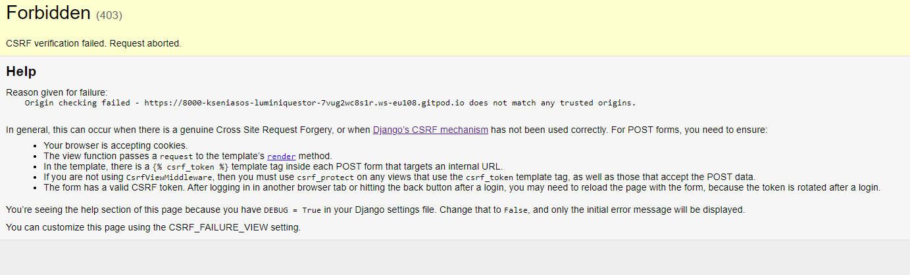
    
 

* When using bootstrap 5 the ***JS* didn't work** with toast companents so I had to add some extra code.

  [See Doc.](https://getbootstrap.com/docs/5.0/components/toasts/#usage)
  
    

<b>Inintialise toasts via JavaScript</b>

    
    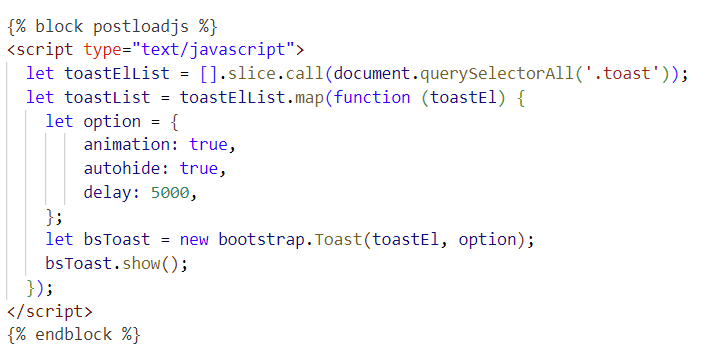
    
 

* Dulicate ID on all_products page. Changed id to class and remaned.

    

<b>Html Validator</b>

    
    
    
 
  
* As a not authenticated users could not open the project detail view. Mistake found quiqly. There was a line *profile = get_object_or_404(UserProfile, user=request.user)*  which blocked this access in view.py.

    

<b>Project Deatil view</b>

    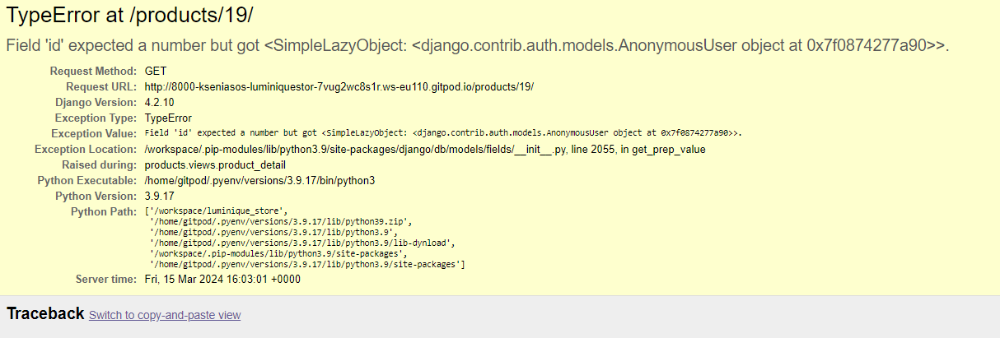    
    
 

### Unfixed Bugs

* **Missing form label.** Wave testing showas an error in footer.This was a code from Mailchimp, so I didn't changed it to escape problems in the future.

    

<b>Wave Bug</b>

    
    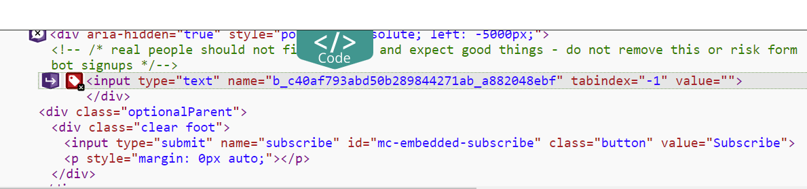
    
 
  